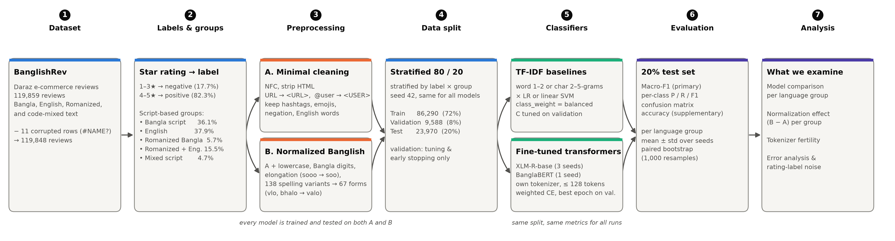

# Romanized or Code-Mixed? Dissecting Sentiment Classification of Banglish Product Reviews

Binary sentiment classification (positive / negative) of Bangladeshi e-commerce reviews written in
Bangla script, English, **Romanized Bangla** ("dam hiseve onek valo") and **Romanized Bangla–English
code-mixed** text ("choto morich but jhaal beshi").

Romanized Bangla and code-mixing overlap, but they are not the same thing. This project keeps them
apart and asks three questions:

1. Which kind of text is hardest, for classic and transformer models?
2. Does normalizing Romanized Bangla spelling help, and for which models?
3. How much of the remaining error comes from noisy, rating-derived labels?



---

## Key results (20% held-out test set, 23,970 reviews)

| Model | Text | Macro-F1 | Accuracy | Romanized Bangla F1 |
|---|---|---|---|---|
| Word TF-IDF + linear SVM | minimal | 0.800 | 0.868 | 0.758 |
| XLM-R-base (3 seeds) | normalized | 0.820 ± 0.001 | 0.884 ± 0.001 | 0.776 ± 0.003 |
| **BanglaBERT** (1 seed) | **normalized** | **0.826** | **0.891** | **0.792** |

Macro-F1 is the primary metric. The test set is 82% positive, so a model that always predicts
"positive" already reaches 82% accuracy.

**Findings**
- **Pure Romanized Bangla is the hardest group for every model.** Romanized + English code-mixed
  text is easier (for example 0.831 vs 0.792 macro-F1 for BanglaBERT).
- **Transformers beat TF-IDF** by 2–2.6 macro-F1 points, and the difference is significant under a
  paired bootstrap.
- **Spelling normalization does not change TF-IDF results.** For transformers it consistently helps
  Romanized Bangla: +0.014 ± 0.004 for XLM-R (positive on all 3 seeds) and +0.014 for BanglaBERT.
  It works by reducing the number of subword pieces per word. The overall gain is small
  (+0.003 ± 0.004).
- **Label noise is large.** 5.5% of test reviews are misclassified by all 16 runs. In a provisional
  reading of 60 of them, 67% have a star rating that contradicts the text (for example 5★
  "Bad, very bad"), and only 2% are real model mistakes. 3★ reviews have a 44% error rate.

Full tables are in [`results/step7/tables.md`](results/step7/tables.md) and the error analysis is in
[`results/step7/error_analysis.md`](results/step7/error_analysis.md).

---

## Dataset

**BanglishRev** (Shamael et al.): Daraz Bangladesh product reviews. This project uses the provided
release `banglishrev_data/banglishrev.csv`:
- 119,859 reviews; 11 corrupted `#NAME?` rows are dropped, leaving 119,848.
- **Labels come from star ratings:** 1–3★ → negative (17.7%), 4–5★ → positive (82.3%).
- **Language groups are assigned from the script actually used** (Bengali Unicode vs Latin letters)
  together with the dataset's `is_codemixed` flag. The dataset's `is_romanized` flag is not used
  because it misses 6,562 Latin-script Banglish reviews.

| Group | Share | Example |
|---|---|---|
| Bangla script | 36.1% | অনেক সুন্দর শাড়ি টা |
| English | 37.9% | fast delivery... product quality good |
| Romanized Bangla | 5.7% | sob miliye valo cilo apnara caile nite paren |
| Romanized + English | 15.5% | Best facewash... skin onk smooth kore day |
| Mixed script | 4.7% | Packing করা ছিল, but not properly |

**Split:** stratified by label × language group (seed 42). 80% train / 20% test, with 10% of the
training part held out for validation (tuning and early stopping only). This gives
86,290 / 9,588 / 23,970 reviews, stored in `data/split_80_20.csv` and shared by every model.

---

## Project structure

```
banglishrev_data/banglishrev.csv   raw dataset
data/
  groups.csv                       script-based language group per review
  clean.csv                        text_min + text_norm per review
  romanized_lexicon.tsv            138 spelling variants -> 67 canonical forms
  split_80_20.csv                  train / val / test assignment (shared by all models)
src/
  common.py                        split + evaluation shared by all models
  01_data_audit.py                 step 1: groups, statistics, data quality
  02_preprocess.py                 step 2: minimal and normalized text
  03_baselines.py                  steps 3-4: TF-IDF x (LR, linear SVM)
  04_compare.py                    step 4: paired bootstrap, minimal vs normalized
  05_transformer.py                steps 5-6: fine-tune XLM-R / BanglaBERT (GPU)
  05_summary.py                    step 5 report (XLM-R vs baselines)
  06_summary.py                    step 6 report (BanglaBERT, seed variance)
  07_final.py                      step 7: paper tables, figures, error analysis
  08_method_diagram.py             methodology figure
colab/
  step5_xlmr.ipynb                 notebook for training on Google Colab
  banglish_bundle.zip              code + data to upload to Colab
results/
  step1 ... step7/                 reports (report.md), metrics, predictions, figures
  figures/                         methodology diagram (pdf / png / svg)
```

---

## Pipeline

| Step | What it does | Script | Output |
|---|---|---|---|
| 1 | Data audit, script-based language groups | `01_data_audit.py` | `results/step1/report.md` |
| 2 | Two text versions: **minimal** (HTML, `<URL>`, `<USER>`, whitespace; keeps emojis, negation, English) and **normalized** (+ lowercase, Bangla digits, elongation, spelling lexicon) | `02_preprocess.py` | `data/clean.csv`, `results/step2/` |
| 3 | TF-IDF baselines on minimal text: word 1–2-grams / char 2–5-grams × LR / linear SVM, `class_weight=balanced`, C tuned on validation | `03_baselines.py --text text_min` | `results/step3/` |
| 4 | Same baselines on normalized text, plus a paired bootstrap comparison | `03_baselines.py --text text_norm`, `04_compare.py` | `results/step4/` |
| 5 | Fine-tune XLM-R-base (own tokenizer, max 128 tokens, class-weighted CE, 3 epochs, best epoch on validation) | `05_transformer.py`, `05_summary.py` | `results/step5/` |
| 6 | BanglaBERT with its own normalizer; extra XLM-R seeds 43, 44 | `05_transformer.py`, `06_summary.py` | `results/step6/` |
| 7 | Final tables (CSV / LaTeX), figures, error analysis, label-noise check | `07_final.py` | `results/step7/` |

Deliberately **not** used: stopword removal, stemming, emoji-to-sentiment conversion, removing
non-Bengali characters, and any label-derived features.

---

## How to reproduce

### Requirements

Python 3.11. Tested with pandas 3.0, scikit-learn 1.9, PyTorch 2.6, transformers 5.17 and
matplotlib 3.11.

```bash
pip install -r requirements.txt
```

BanglaBERT also needs its official normalizer:

```bash
pip install git+https://github.com/csebuetnlp/normalizer
```

### Steps 1–4 and 7 (CPU, about 15 minutes in total)

```bash
cd src
python 01_data_audit.py
python 02_preprocess.py
python 03_baselines.py --text text_min
python 03_baselines.py --text text_norm
python 04_compare.py
```

### Steps 5–6 (GPU)

These need a GPU. They were tested on a 16 GB Tesla T4, where XLM-R takes about 27 minutes per run
and BanglaBERT about 20 minutes.

```bash
python 05_transformer.py --model xlm-roberta-base --text text_min --seed 42
python 05_transformer.py --model xlm-roberta-base --text text_norm --seed 42
python 05_transformer.py --model csebuetnlp/banglabert --text text_min
python 05_transformer.py --model csebuetnlp/banglabert --text text_norm
python 05_summary.py
python 06_summary.py
```

To run these on **Google Colab**: open `colab/step5_xlmr.ipynb`, select a T4 GPU, upload
`colab/banglish_bundle.zip`, run the training commands, and download the results zip back into the
project folder.

For a small local GPU (4 GB) smoke test, run:

```bash
python 05_transformer.py --limit 2000 --epochs 1 --batch 8 --freeze_embeddings
```

### Final tables and figures

```bash
python 07_final.py
python 08_method_diagram.py
```

---

## Outputs for the paper

| File | Content |
|---|---|
| `results/step7/T1_overall.{csv,tex}` | Overall macro-F1, per-class P/R/F1, accuracy |
| `results/step7/T2_per_group.{csv,tex}` | Macro-F1 per language group |
| `results/step7/T3_normalization.{csv,tex}` | Normalization effect (normalized − minimal) |
| `results/figures/fig0_methodology.pdf` | Methodology diagram |
| `results/step7/fig1_per_group_macro_f1.pdf` | Model comparison per group |
| `results/step7/fig2_normalization_effect.pdf` | Normalization effect per group |
| `results/step7/fig3_confusion_best.pdf` | Confusion matrix of the best model |
| `results/step7/fig4_error_by_stars.pdf` | Error rate by star rating |
| `results/step7/annotation_sample.csv` | 200 consensus errors for a manual label-noise check |

---

## Limitations

- **Labels come from star ratings and are noisy.** The label-noise estimate is a provisional reading
  of 60 reviews; `annotation_sample.csv` is ready for a human check.
- **3★ reviews are treated as negative**, following the dataset. These are the hardest cases.
- **The data is a 120k-review release from a single e-commerce site (Daraz).**
- **BanglaBERT results use one seed**, while XLM-R uses three.
- **Results are not directly comparable to the original BanglishRev paper.** That paper uses a
  different data size and split, and BanglishBERT, which is not evaluated here.

## Planned extensions

- BanglishBERT, and two more BanglaBERT seeds.
- Human annotation of `annotation_sample.csv`, with inter-annotator agreement.
- An ablation on how 3★ reviews are handled (negative / removed / neutral).
- Evaluation on a second Bangla or Banglish sentiment dataset.

## Acknowledgements

Dataset: BanglishRev (Shamael et al.). Models: XLM-RoBERTa (Conneau et al., 2020), BanglaBERT
(Bhattacharjee et al., 2022). Please cite the original works when using this code or its results.
